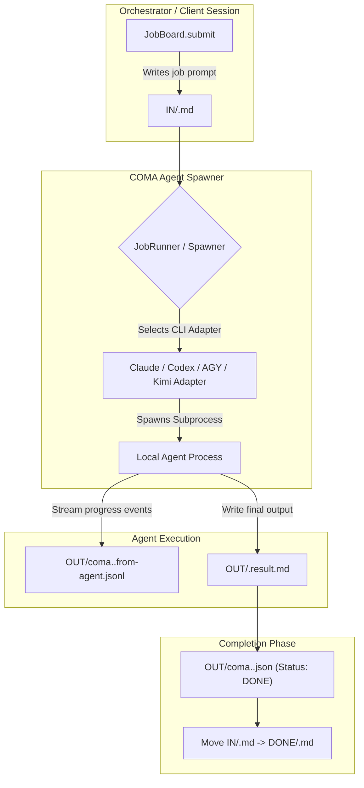
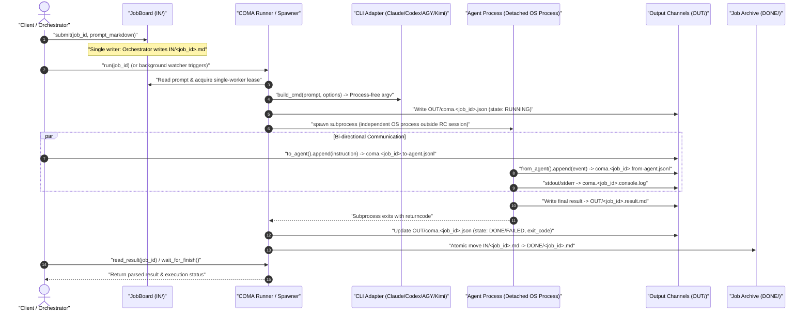

# COMA — Command & Communication for Autonomous Agents

**[English](README.md) | [Deutsch](README_de.md)**

[](https://docs.pytest.org/)
[](pyproject.toml)
[](https://www.python.org/)
[-brightgreen.svg)](pyproject.toml)
[](SECURITY.md)
[](KONZEPT.md)
[](KONZEPT.md)
[](SECURITY.md)
[](LICENSE)
[](llms.txt)
[](https://github.com/ellmos-ai)
[](https://github.com/open-bricks)

> [!NOTE]
> **LLM / AI Context Index:** For an AI-optimized specification, tool signatures, and architecture overview, see [`llms.txt`](llms.txt).

> **Name Migration Notice:** The project and canonical Python package are named `COMA` / `coma`. The legacy name `COMAS`/`comas` remains available during a transition period as an import and CLI alias; new integrations must use `coma`.

---

### Quick Navigation

[What Is COMA?](#what-is-coma) · [Use Cases](#use-cases) · [Quickstart](#quickstart) · [Job Protocol](#job-protocol) · [Architecture Flow](#architecture-flow) · [Lifecycle Sequence](#lifecycle-sequence) · [Spawner Layer](#spawner-layer) · [Interactive & Headless Sessions](#interactive-and-headless-sessions) · [Starters from Roles](#starters-from-roles) · [Governance & Invariants](#governance-and-runtime-invariants) · [CLI Commands](#cli-commands) · [Testing](#testing) · [Ecosystem](#sibling-tools--ecosystem) · [Security](#security) · [License](#license)

---

## What Is COMA?

> **The Agent Lifecycle Layer:** How is an autonomous AI agent spawned as a standalone process, and how do you communicate with it while it runs?

COMA is a **session-decoupled communication channel and process spawner for autonomous AI agents** (file-system based via `IN/`, `OUT/`, `DONE/`). The name stands for **Command & Communication for Agents**.

Single responsibility: COMA does not handle permissions, locks, or long-term agent memory. It works strictly with local files and standard OS processes—**no account required, no network services, no cluster dependencies**. Zero third-party dependencies, standard library only.

See [`KONZEPT.md`](KONZEPT.md) for background details, motivations, and architectural decisions.

| Layer | Core Question | Handled By |
|---|---|---|
| **Lifecycle & Communication** | How to spawn an agent and stream input/output? | **COMA** |
| Access Control & Locks | Who can touch which resource/repo? | `lock-master` → Roshambo |
| Memory & History | Was this attempted before, what was the outcome? | `memoryhooker` / Roshambo |

Separation of verbs: COMA uses `spawn`, `send`, `poll`, `result`. A coordinator uses `claim`, `release`, `remember`, `recall`, `decide`, `status`. No overlap.

---

## Use Cases

1. **Decoupling from Remote Control (RC) Sessions**
   In interactive remote-control sessions, CLI permission bypass flags like `--dangerously-skip-permissions` may fail to pass through to remote clients (open issues [#71518](https://github.com/anthropics/claude-code/issues/71518), [#29214](https://github.com/anthropics/claude-code/issues/29214)). COMA launches the agent as an independent OS process outside the RC session, communicating cleanly via file-system channels.

2. **Session-Independent Handoffs & Relays**
   Tasks can be handed off across session boundaries between agents without blocking process threads or losing context.

3. **Background Job Execution**
   File-system based queueing (`IN/`, `OUT/`, `DONE/`) for autonomous background runners and decoupled tool executions.

---

## Quickstart

```python
from coma import JobBoard, JobRunner

board = JobBoard(r"C:\jobs\_agentjobs")
board.submit("myjob", "# Instructions\nWrite result to OUT/myjob.result.md.\n")

result = JobRunner(board).run("myjob")
print(result["status"]["state"], result["result_written"])
```

Or from the command line:

```bat
coma --root C:\jobs\_agentjobs run myjob
coma --root C:\jobs\_agentjobs run myjob --dry-run   :: preview command without launching
coma --root C:\jobs\_agentjobs status myjob
coma --root C:\jobs\_agentjobs result myjob
```

---

## Job Protocol

```
IN/    <jobid>.md                       Job prompt (Markdown)
OUT/   <jobid>.result.md                Final agent result output
       coma.<jobid>.json               Runner status (written by runner only)
       coma.<jobid>.from-agent.jsonl   Progress stream (written by agent only)
       coma.<jobid>.to-agent.jsonl     Instruction stream (written by orchestrator only)
       coma.<jobid>.console.log        Combined stdout / stderr log
DONE/  <jobid>.md                       Completed job prompt
```

**Single writer per file:** No locking required, structural collision prevention.

---

## Architecture Flow



---

## Lifecycle Sequence

The sequence below illustrates the end-to-end decoupled lifecycle between an orchestrator, COMA runner, agent process, and the file-based channels:



---

## Spawner Layer

Adapters encapsulate CLI arguments for specific agent engines:

```python
from coma import ClaudeAdapter, Spawner

adapter = ClaudeAdapter(model="sonnet", permission_mode="dontAsk",
                        allowed_tools=["Read", "Write"], max_budget_usd=2.0)
print(adapter.build_cmd("Say Hello"))   # Returns argument list without running

spawner = Spawner(adapter)
result = spawner.run("Say Hello", log_file="run.log")
```

### Verified Adapters

| Adapter | Target Engine | Status |
|---|---|---|
| `claude` | Anthropic Claude Code CLI | **Verified** — Flags checked against `claude --help` 2.1.263 |
| `codex` | OpenAI Codex CLI | **Verified** — Tested against CLI 0.153.4 |
| `agy` | Google Antigravity / AGY CLI | **Verified** — Tested against agy 1.1.27 |
| `kimi` | Kimi Code CLI | **Skeleton** — help contract checked with CLI 0.31.0; no real prompt run |

---

## Interactive and Headless Sessions

`build_session_plan()` provides one process-free contract for interactive and
headless Claude, Codex, AGY and Kimi argv. A role prompt file and the user
request remain separate arguments. `ordered_candidates()` and
`available_candidates()` build a deterministic provider fallback chain, while
`build_probe_command()` and `probe()` provide a bounded read-only reachability
check with child-process cleanup. Kimi remains fail-closed unless a caller that
already owns a verified Kimi contract explicitly opts in.

```python
from coma import build_session_plan

plan = build_session_plan(
    "codex", prompt_file="AGENTS.md", request="Review the current change.",
    mode="interactive", model="gpt-6", effort="high", cwd=".",
)
print(plan.command)  # argv only; no process has started
```

---

## Starters from `roles[]`

`coma starters generate` reads the module's top-level `roles[]` declarations
and writes a thin `START.bat` plus executable `start.sh`. Both forward to the
unified console when it is installed and expose a visible COMA fallback when it
is not. The generator only replaces files carrying its own marker unless
`--force` is explicit.

```bat
coma starters generate --manifest ellmos-module.v2.json --output-dir starters
starters\START.bat tasksolver --provider codex --dry-run
```

---

## Governance and Runtime Invariants

To preserve security, system integrity, and predictability, COMA adheres to 8 strict invariants:

| ID | Invariant | Description |
|---|---|---|
| **INV-COMA-01** | **Single-Writer Rule** | Each channel file in `_agentjobs/` has exactly one writer (`IN/` by submitter, `to-agent.jsonl` by orchestrator, `from-agent.jsonl`/`result.md` by agent, `coma.<jobid>.json` by runner). Eliminates lock contention and sync conflicts. |
| **INV-COMA-02** | **Zero Network Egress** | The core COMA library makes 0 network connections, opens no ports, and has zero external package dependencies. Standard library only. |
| **INV-COMA-03** | **Session Decoupling** | Subprocesses run in dedicated, independent OS process trees outside interactive terminal sessions, bypassing remote-control interactive permission stalls. |
| **INV-COMA-04** | **Process-Free Dry Runs** | Command builders (`build_cmd`, `build_session_plan`, `--dry-run`) construct argument lists deterministically without starting processes or consuming LLM tokens. |
| **INV-COMA-05** | **Deterministic CLI Fallback** | Multi-provider fallback chains (`ordered_candidates`) resolve binaries deterministically without silent execution of unverified engines. |
| **INV-COMA-06** | **Fail-Closed Provider Safety** | Unverified or experimental adapters (such as Kimi) remain fail-closed and reject real prompt runs unless callers explicitly opt in with an established contract. |
| **INV-COMA-07** | **Bounded Probe Cleanup** | Reachability probes (`probe()`) enforce strict execution timeouts and guarantee child-process cleanup to avoid orphaned processes. |
| **INV-COMA-08** | **Idempotent Dual-Platform Starters** | Starter scripts (`START.bat`, `start.sh`) generated from `roles[]` carry unique marker guards preventing accidental overwrites of custom wrappers. |

---

## CLI Commands

| Command | Purpose |
|---|---|
| `run [jobid]` | Execute job from queue |
| `run ... --dry-run` | Build and show command string without executing |
| `cmd <prompt>` | Show command string for custom prompt |
| `session --provider … --prompt-file … --request …` | Plan or start an interactive/headless role session |
| `starters generate` · `starters run` | Generate dual-platform `roles[]` starters or use their COMA fallback |
| `submit <jobid>` | Submit job prompt into `IN/` |
| `status <jobid>` · `list` | Check status of job(s) |
| `result <jobid>` · `log <jobid>` | Read result output or console log |
| `send <jobid> <text>` · `inbox <jobid>` | Send message or read progress stream |
| `adapters` | Show adapter status & detected binaries |
| `check` · `vendor` | Verify or build vendor manifest |

---

## Testing

```bat
python -m pytest -q      :: 270 passed tests
```

Tests never start a provider. One bounded probe test uses the local Python
interpreter as a harmless fake CLI; all remaining subprocess calls are mocked.

---

## Sibling Tools & Ecosystem

COMA is part of the `ellmos-ai` orchestration architecture and the broader `open-bricks` open-source umbrella:

| Layer / Ecosystem | Repository | Purpose |
|---|---|---|
| **Agent Orchestration** | [`ellmos-ai/coma`](https://github.com/ellmos-ai/coma) | Process lifecycle spawner & session-decoupled job board |
| **Autonomous Stream** | [`ellmos-ai/rinnsal`](https://github.com/ellmos-ai/rinnsal) | SQLite-buffered autonomous stream engine & connector relay |
| **Condition Verification** | [`ellmos-ai/condition-gates`](https://github.com/ellmos-ai/condition-gates) | Precondition checking, evidence validation & runtime invariants |
| **Lock Governance** | [`ellmos-ai/lock-master`](https://github.com/ellmos-ai/lock-master) | Central project locks & Multi-Tree coordination (Roshambo) |
| **Hook Management** | [`ellmos-ai/hook-master`](https://github.com/ellmos-ai/hook-master) | Canonical hook management & multi-agent materialization |
| **Policy Registry** | [`ellmos-ai/policy-registry`](https://github.com/ellmos-ai/policy-registry) | Central governance, role definitions & delegation rules |
| **Fleet Operations** | [`ellmos-ai/agent-ops-stack`](https://github.com/ellmos-ai/agent-ops-stack) | Multi-agent operations, health telemetry & monitoring |
| **Data Transit** | [`ellmos-ai/sqlite-transit-sync`](https://github.com/ellmos-ai/sqlite-transit-sync) | Zero-copy transaction sync & SQLite replication |
| **Automation Flow** | [`ellmos-ai/workflowhooker`](https://github.com/ellmos-ai/workflowhooker) | Event triggers, pipeline hooks & webhook orchestration |
| **Memory Retention** | [`ellmos-ai/memoryhooker`](https://github.com/ellmos-ai/memoryhooker) | Context retention, episodic memory & lesson synthesis |
| **Agent Bootstrap** | [`dev-bricks/safe-start-for-codex`](https://github.com/dev-bricks/safe-start-for-codex) | Safe startup, environment checks & preflight diagnostics |
| **Umbrella Ecosystem** | [`open-bricks`](https://github.com/open-bricks) | Open-source foundation for local-first developer tools |

---

## Security

For subprocess isolation details, single-writer protocol boundaries, and vulnerability disclosure policies, see [`SECURITY.md`](SECURITY.md).

---

## License

MIT License. Developed under the `ellmos-ai` / `open-bricks` ecosystem.
