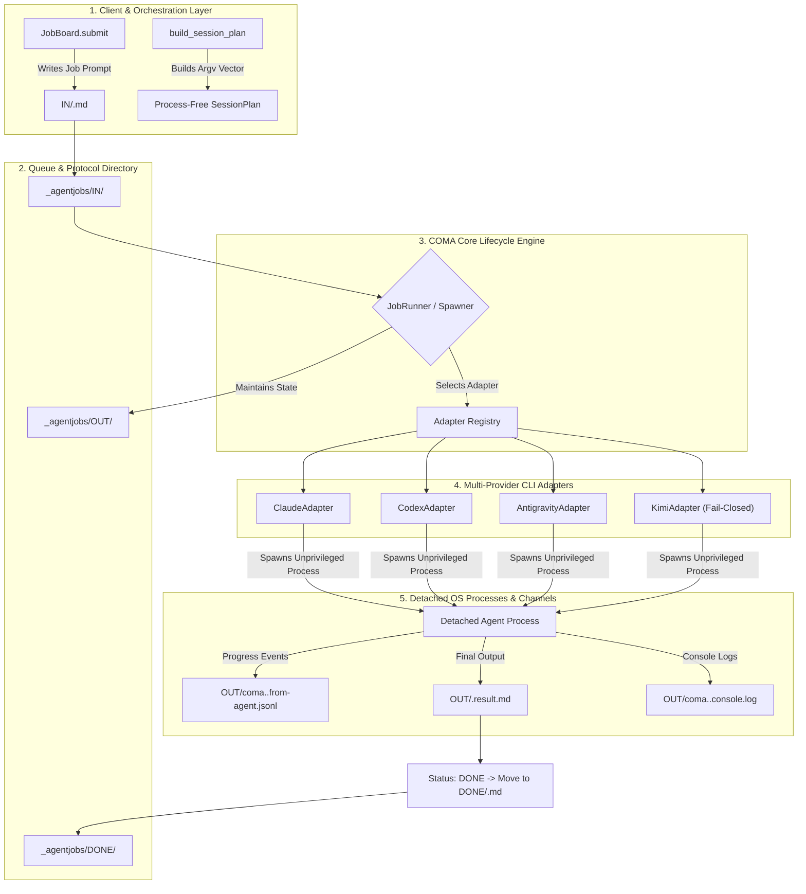
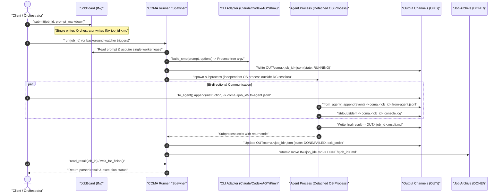

# COMA — Command & Communication for Autonomous Agents

**[English](README.md) | [Deutsch](README_de.md)**

[](https://docs.pytest.org/)
[](pyproject.toml)
[](https://www.python.org/)
[-brightgreen.svg)](pyproject.toml)
[](SECURITY.md)
[](THIRD_PARTY_LICENSES.md)
[](KONZEPT.md)
[](KONZEPT.md)
[](SECURITY.md)
[](LICENSE)
[](llms.txt)
[](https://github.com/ellmos-ai)
[](https://github.com/open-bricks)

> [!NOTE]
> **LLM / AI Context Index:** For an AI-optimized specification, tool signatures, and architecture overview, see [`llms.txt`](llms.txt).

> **Name Migration Notice:** The project and canonical Python package are named `COMA` / `coma`. The legacy name `COMAS`/`comas` remains available during a transition period as an import and CLI alias; new integrations must use `coma`.

---

### Quick Navigation

1. [What Is COMA? & Value Proposition](#1-what-is-coma) · 2. [Primary Use Cases & Session Decoupling](#2-use-cases) · 3. [Target Personas & Discoverability](#3-target-personas--discoverability) · 4. [Quickstart & Command Line Usage](#4-quickstart) · 5. [File-Based Job Board Protocol](#5-job-protocol) · 6. [Spawner Layer & Multi-Engine CLI Adapters](#6-spawner-layer) · 7. [Interactive & Headless Session Planning](#7-interactive-and-headless-sessions) · 8. [Starters from roles[] Declarations](#8-starters-from-roles) · 9. [10-Dimension Comparative Matrix](#9-comparative-matrix-vs-alternatives) · 10. [Dual Mermaid Diagrams](#10-dual-mermaid-diagrams) · 11. [Governance & 10 Runtime Invariants](#11-governance-and-runtime-invariants) · 12. [CLI Commands Reference](#12-cli-commands) · 13. [Testing & Verification Suite](#13-testing) · 14. [Third-Party Licenses & Level 1 SBOM](#14-third-party-licenses--sbom) · 15. [Sibling Ecosystem & Integration](#15-sibling-tools--ecosystem) · 16. [Security Policy & Subprocess Isolation](#16-security) · 17. [Statutory Notice (§ 521 BGB)](#17-statutory-notice--liability-limitation) · 18. [License & Open-Source Umbrella](#18-license--umbrella)

---

<a id="1-what-is-coma--value-proposition"></a>
<a id="1-what-is-coma"></a>
<a id="what-is-coma"></a>
<a id="1-was-ist-coma--kernnutzen"></a>
<a id="1-was-ist-coma"></a>
<a id="was-ist-coma"></a>
<a id="1-features"></a>
<a id="features"></a>
## 1. What Is COMA? & Value Proposition

> **The Agent Lifecycle Layer:** How is an autonomous AI agent spawned as a standalone process, and how do you communicate with it while it runs?

COMA is a **session-decoupled communication channel and process spawner for autonomous AI agents** (file-system based via `IN/`, `OUT/`, `DONE/`). The name stands for **Command & Communication for Autonomous Subagents**.

Single responsibility: COMA does not handle permissions, locks, or long-term agent memory. It works strictly with local files and standard OS processes—**no account required, no network services, no cluster dependencies**. Zero third-party dependencies, standard library only.

See [`KONZEPT.md`](KONZEPT.md) for background details, motivations, and architectural decisions.

| Layer | Core Question | Handled By |
|---|---|---|
| **Lifecycle & Communication** | How to spawn an agent and stream input/output? | **COMA** |
| Access Control & Locks | Who can touch which resource/repo? | `lock-master` → Roshambo |
| Memory & History | Was this attempted before, what was the outcome? | `memoryhooker` / Roshambo |

Separation of verbs: COMA uses `spawn`, `send`, `poll`, `result`. A coordinator uses `claim`, `release`, `remember`, `recall`, `decide`, `status`. No overlap.

---

<a id="2-primary-use-cases--session-decoupling"></a>
<a id="2-use-cases"></a>
<a id="use-cases"></a>
<a id="2-primaere-anwendungsfaelle--session-entkopplung"></a>
<a id="2-anwendungsfaelle"></a>
<a id="anwendungsfaelle"></a>
## 2. Primary Use Cases & Session Decoupling

1. **Decoupling from Remote Control (RC) Sessions**
   In interactive remote-control sessions, CLI permission bypass flags like `--dangerously-skip-permissions` may fail to pass through to remote clients (open issues [#71518](https://github.com/anthropics/claude-code/issues/71518), [#29214](https://github.com/anthropics/claude-code/issues/29214)). COMA launches the agent as an independent OS process outside the RC session, communicating cleanly via file-system channels.

2. **Session-Independent Handoffs & Relays**
   Tasks can be handed off across session boundaries between agents without blocking process threads or losing context.

3. **Background Job Execution**
   File-system based queueing (`IN/`, `OUT/`, `DONE/`) for autonomous background runners and decoupled tool executions.

---

<a id="3-target-personas--discoverability"></a>
<a id="3-personas"></a>
<a id="target-personas--discoverability"></a>
<a id="personas"></a>
<a id="3-zielgruppen--auffindbarkeit"></a>
<a id="3-zielgruppen"></a>
<a id="zielgruppen--auffindbarkeit"></a>
## 3. Target Personas & Discoverability

### Target Personas

- **[PERSONA-01] Autonomous Agent Framework Engineers & Swarm Architects:**
  - *Context:* Developers designing multi-agent swarms, relay pipelines, or hierarchical agent hierarchies across Claude Code, OpenAI Codex, and Google Antigravity.
  - *Pain Point:* Subprocess management and inter-agent communication are typically tightly coupled to brittle IPC pipes, sockets, or complex cloud servers that fail when child processes hang.
  - *How COMA Solves It:* Pure file-system based queueing and bi-directional streaming channels (`to-agent.jsonl`, `from-agent.jsonl`) with single-writer guarantees (`INV-COMA-01`) and session decoupling (`INV-COMA-03`).

- **[PERSONA-02] Local-First & Sovereign AI Developers:**
  - *Context:* Engineers running AI developer toolchains locally on sovereign workstations and air-gapped environments without external cloud telemetry or mandatory accounts.
  - *Pain Point:* Modern orchestration tools enforce cloud dependencies, Docker daemons, Redis clusters, or SaaS subscriptions just to run a child agent.
  - *How COMA Solves It:* Zero external runtime dependencies (100% standard library `INV-COMA-02`), zero network egress, and fully self-contained directory protocol (`IN/`, `OUT/`, `DONE/`).

- **[PERSONA-03] Remote Control & Headless Automation DevOps:**
  - *Context:* DevOps engineers orchestrating headless runs, scheduled tasks, or remote terminal sessions (e.g. VS Code Remote, SSH, Antigravity/Claude remote control).
  - *Pain Point:* Interactive permission bypass flags (e.g. `--dangerously-skip-permissions`, `--yolo`) fail to pass through remote sessions (open Anthropic issues #71518, #29214), stalling unattended automation for manual user approval.
  - *How COMA Solves It:* Spawns agents in detached, independent OS process trees outside the remote-control session with verifiable, process-free dry-run contracts (`INV-COMA-04`).

- **[PERSONA-04] Enterprise Security Officers & Systems Auditors:**
  - *Context:* Security compliance teams auditing enterprise codebases for supply-chain risks, privilege escalation, and data exfiltration.
  - *Pain Point:* Agent frameworks bundle hundreds of transitive node/python dependencies, spawn uncontrolled background daemons, or demand root/administrator privileges.
  - *How COMA Solves It:* Zero third-party dependencies, strictly unprivileged user-mode execution (`RunAsInvoker` / `INV-COMA-09`), fail-closed adapter safety (`INV-COMA-06`), and strict 48h security triage SLA (`INV-COMA-10`).

### High-Intent Search Queries

| Language | High-Intent Search Queries |
|---|---|
| **English (EN)** | `autonomous agent lifecycle manager python` · `session decoupled agent runner` · `claude code cli spawner` · `codex cli subprocess orchestration` · `local-first agent communication channel` · `file-based agent job board` · `zero dependency agent spawner` · `bypass claude code remote control permission stall` |
| **German (DE)** | `autonome ki agenten lebenszyklus python` · `agenten prozess entkopplung dateibasiert` · `claude code cli automatisierung spawner` · `ki agenten job board ohne redis` · `lokale agenten steuerung standardbibliothek` · `remote session rechteabfrage umgehen agenten` · `multi agenten kommunikation dateisystem` · `offline agenten runner python stdlib` |

---

<a id="4-quickstart--command-line-usage"></a>
<a id="4-quickstart"></a>
<a id="quickstart"></a>
<a id="4-schnellstart--kommandozeilen-nutzung"></a>
<a id="4-schnellstart"></a>
<a id="schnellstart"></a>
## 4. Quickstart & Command Line Usage

```python
from coma import JobBoard, JobRunner

board = JobBoard(r"C:\jobs\_agentjobs")
board.submit("myjob", "# Instructions\nWrite result to OUT/myjob.result.md.\n")

result = JobRunner(board).run("myjob")
print(result["status"]["state"], result["result_written"])
```

Or from the command line:

```bat
coma --root C:\jobs\_agentjobs run myjob
coma --root C:\jobs\_agentjobs run myjob --dry-run   :: preview command without launching
coma --root C:\jobs\_agentjobs status myjob
coma --root C:\jobs\_agentjobs result myjob
```

`--dry-run` constructs the complete command and displays it without consuming tokens or starting a process.

---

<a id="5-file-based-job-board-protocol"></a>
<a id="5-job-protocol"></a>
<a id="job-protocol"></a>
<a id="5-dateibasiertes-job-board-protokoll"></a>
<a id="5-job-protokoll"></a>
<a id="das-protokoll"></a>
<a id="protokoll"></a>
## 5. File-Based Job Board Protocol

```
IN/    <jobid>.md                       Job prompt (Markdown)
OUT/   <jobid>.result.md                Final agent result output
       coma.<jobid>.json               Runner status (written by runner only)
       coma.<jobid>.from-agent.jsonl   Progress stream (written by agent only)
       coma.<jobid>.to-agent.jsonl     Instruction stream (written by orchestrator only)
       coma.<jobid>.console.log        Combined stdout / stderr log
DONE/  <jobid>.md                       Completed job prompt
```

**Single writer per file:** No locking required, structural collision prevention.

---

<a id="6-spawner-layer--multi-engine-cli-adapters"></a>
<a id="6-spawner-layer"></a>
<a id="spawner-layer"></a>
<a id="6-spawner-schicht--multi-engine-cli-adapter"></a>
<a id="6-spawn-schicht"></a>
<a id="die-spawn-schicht"></a>
## 6. Spawner Layer & Multi-Engine CLI Adapters

Adapters encapsulate CLI arguments for specific agent engines:

```python
from coma import ClaudeAdapter, Spawner

adapter = ClaudeAdapter(model="sonnet", permission_mode="dontAsk",
                        allowed_tools=["Read", "Write"], max_budget_usd=2.0)
print(adapter.build_cmd("Say Hello"))   # Returns argument list without running

spawner = Spawner(adapter)
result = spawner.run("Say Hello", log_file="run.log")
```

### Verified Adapters

| Adapter | Target Engine | Status |
|---|---|---|
| `claude` | Anthropic Claude Code CLI | **Verified** — Flags checked against `claude --help` 2.1.263 |
| `codex` | OpenAI Codex CLI | **Verified** — Tested against CLI 0.153.4 |
| `agy` | Google Antigravity / AGY CLI | **Verified** — Tested against agy 1.1.27 |
| `kimi` | Kimi Code CLI | **Skeleton** — help contract checked with CLI 0.31.0; no real prompt run |

---

<a id="7-interactive-and-headless-session-planning"></a>
<a id="7-interactive-and-headless-sessions"></a>
<a id="interactive-and-headless-sessions"></a>
<a id="7-interaktive-und-headless-sitzungsplanung"></a>
<a id="7-interaktive-und-headless-sitzungen"></a>
<a id="interaktive-und-headless-sitzungen"></a>
## 7. Interactive and Headless Session Planning

`build_session_plan()` provides one process-free contract for interactive and
headless Claude, Codex, AGY and Kimi argv. A role prompt file and the user
request remain separate arguments. `ordered_candidates()` and
`available_candidates()` build a deterministic provider fallback chain, while
`build_probe_command()` and `probe()` provide a bounded read-only reachability
check with child-process cleanup. Kimi remains fail-closed unless a caller that
already owns a verified Kimi contract explicitly opts in.

```python
from coma import build_session_plan

plan = build_session_plan(
    "codex", prompt_file="AGENTS.md", request="Review the current change.",
    mode="interactive", model="gpt-6", effort="high", cwd=".",
)
print(plan.command)  # argv only; no process has started
```

---

<a id="8-starters-from-roles-declarations"></a>
<a id="8-starters-from-roles"></a>
<a id="starters-from-roles"></a>
<a id="8-starter-aus-roles-deklarationen"></a>
<a id="8-starter-aus-roles"></a>
<a id="starter-aus-roles"></a>
## 8. Starters from roles[] Declarations

`coma starters generate` reads the module's top-level `roles[]` declarations
and writes a thin `START.bat` plus executable `start.sh`. Both forward to the
unified console when it is installed and expose a visible COMA fallback when it
is not. The generator only replaces files carrying its own marker unless
`--force` is explicit.

```bat
coma starters generate --manifest ellmos-module.v2.json --output-dir starters
starters\START.bat tasksolver --provider codex --dry-run
```

---

<a id="9-10-dimension-comparative-matrix-vs-alternatives"></a>
<a id="9-comparative-matrix-vs-alternatives"></a>
<a id="comparative-matrix-vs-alternatives"></a>
<a id="comparative-matrix"></a>
<a id="9-10-dimensionen-vergleichsmatrix-vs-alternativen"></a>
<a id="9-vergleichsmatrix-vs-alternativen"></a>
<a id="vergleichsmatrix-vs-alternativen"></a>
<a id="vergleichsmatrix"></a>
## 9. 10-Dimension Comparative Matrix vs. Alternatives

| Technical Dimension / Invariant | COMA (`ellmos-ai/coma`) | Celery / RQ / Redis Queue | Temporal / Camunda / Airflow | Raw Python Subprocess | Cloud Agent Frameworks (LangGraph/CrewAI) |
|---|---|---|---|---|---|
| **INV-COMA-01 Single-Writer Protocol** | **Native file protocol (`IN/`, `OUT/`, `DONE/`)** | Requires centralized Redis/RabbitMQ | Database state tables / distributed locks | Unmanaged raw OS pipes (race-prone) | Cloud SaaS database / opaque remote state |
| **INV-COMA-02 Zero Runtime Dependencies** | **100% Python Standard Library** | Multiple third-party packages & brokers | Heavy JVM/Go/Python dependency stack | Python standard library | Heavy third-party dependency tree |
| **INV-COMA-03 Session Decoupling (RC)** | **Detached OS process tree outside RC** | Background workers require daemon setup | Heavy orchestration engine | Child process killed on session exit | Serverless cloud execution (external) |
| **INV-COMA-04 Process-Free Dry Runs** | **Built-in `build_cmd` & `--dry-run`** | None (Queues require live execution) | Complex workflow dry-run mocks | Manual string concatenation | Token-consuming test runs |
| **INV-COMA-05 Multi-Provider Fallback** | **Deterministic `ordered_candidates`** | Static worker routing | Dynamic activity routing | Manual try/except loops | Vendor-locked LLM API adapters |
| **INV-COMA-06 Fail-Closed Provider Safety** | **Explicit opt-in guard (`KimiAdapter`)** | Open execution | Open execution | Silent failure / unhandled exceptions | Silent fallback / hallucinations |
| **INV-COMA-07 Bounded Probe Cleanup** | **Timeouts & child-process reaping** | Heartbeat checks with broker timeouts | Server-side worker timeouts | Can leave orphan zombie processes | Cloud container timeout |
| **INV-COMA-08 Idempotent Starters** | **Marker guards on `START.bat`/`start.sh`** | None | CLI scaffolders | Manual shell scripts | Cloud web dashboard |
| **INV-COMA-09 User-Mode Execution** | **Strictly `RunAsInvoker` (Unprivileged)** | Often requires daemon/systemd service | Often requires daemon/system services | Inherits parent privileges | Container or cloud VM privileges |
| **INV-COMA-10 48h Security SLA** | **48h Acknowledgment & 5d Triage** | Variable open-source tracker | Enterprise SLA ($$$) / Community | None | SaaS SLA (Commercial account required) |

---

<a id="10-dual-mermaid-diagrams-topology--lifecycle"></a>
<a id="10-dual-mermaid-diagrams"></a>
<a id="architecture-flow"></a>
<a id="lifecycle-sequence"></a>
<a id="10-duale-mermaid-diagramme-topologie--lebenszyklus"></a>
<a id="10-duale-mermaid-diagramme"></a>
<a id="architektur-fluss"></a>
<a id="lebenszyklus-sequenz"></a>
## 10. Dual Mermaid Diagrams

### System Architecture Topology (5 Layers)



### End-to-End Decoupled Execution Lifecycle



---

<a id="11-governance--10-runtime-invariants"></a>
<a id="11-governance-and-runtime-invariants"></a>
<a id="governance-and-runtime-invariants"></a>
<a id="11-governance--10-laufzeit-invarianten"></a>
<a id="11-governance--und-laufzeit-invarianten"></a>
<a id="governance--und-laufzeit-invarianten"></a>
<a id="invariants"></a>
## 11. Governance & 10 Runtime Invariants

To preserve security, system integrity, and predictability, COMA adheres to 10 strict invariants:

| ID | Invariant | Description |
|---|---|---|
| **INV-COMA-01** | **Single-Writer Rule** | Each channel file in `_agentjobs/` has exactly one writer (`IN/` by submitter, `to-agent.jsonl` by orchestrator, `from-agent.jsonl`/`result.md` by agent, `coma.<jobid>.json` by runner). Eliminates lock contention and sync conflicts. |
| **INV-COMA-02** | **Zero External Runtime Dependencies** | The core COMA library makes 0 network connections, opens no ports, and has zero external package dependencies. Standard library only. |
| **INV-COMA-03** | **Session Decoupling** | Subprocesses run in dedicated, independent OS process trees outside interactive terminal sessions, bypassing remote-control interactive permission stalls. |
| **INV-COMA-04** | **Process-Free Dry Runs** | Command builders (`build_cmd`, `build_session_plan`, `--dry-run`) construct argument lists deterministically without starting processes or consuming LLM tokens. |
| **INV-COMA-05** | **Deterministic CLI Fallback** | Multi-provider fallback chains (`ordered_candidates`) resolve binaries deterministically without silent execution of unverified engines. |
| **INV-COMA-06** | **Fail-Closed Provider Safety** | Unverified or experimental adapters (such as Kimi) remain fail-closed and reject real prompt runs unless callers explicitly opt in with an established contract. |
| **INV-COMA-07** | **Bounded Probe Cleanup** | Reachability probes (`probe()`) enforce strict execution timeouts and guarantee child-process cleanup to avoid orphaned processes. |
| **INV-COMA-08** | **Idempotent Dual-Platform Starters** | Starter scripts (`START.bat`, `start.sh`) generated from `roles[]` carry unique marker guards preventing accidental overwrites of custom wrappers. |
| **INV-COMA-09** | **Unprivileged User-Mode Execution** | Strictly unprivileged user-space execution (`RunAsInvoker`); zero administrative elevation, driver hooks, or root permissions required. |
| **INV-COMA-10** | **48h Security Response SLA** | Committed 48-hour response SLA and 5-business-day vulnerability triage for all reported security hazards. |

---

<a id="12-cli-commands--options-reference"></a>
<a id="12-cli-commands"></a>
<a id="cli-commands"></a>
<a id="12-cli-befehle--options-referenz"></a>
<a id="12-kommandozeile"></a>
<a id="kommandozeile"></a>
## 12. CLI Commands Reference

| Command | Purpose |
|---|---|
| `run [jobid]` | Execute job from queue |
| `run ... --dry-run` | Build and show command string without executing |
| `cmd <prompt>` | Show command string for custom prompt |
| `session --provider … --prompt-file … --request …` | Plan or start an interactive/headless role session |
| `starters generate` · `starters run` | Generate dual-platform `roles[]` starters or use their COMA fallback |
| `submit <jobid>` | Submit job prompt into `IN/` |
| `status <jobid>` · `list` | Check status of job(s) |
| `result <jobid>` · `log <jobid>` | Read result output or console log |
| `send <jobid> <text>` · `inbox <jobid>` | Send message or read progress stream |
| `adapters` | Show adapter status & detected binaries |
| `check` · `vendor` | Verify or build vendor manifest |

---

<a id="13-testing--verification-suite"></a>
<a id="13-testing"></a>
<a id="testing"></a>
<a id="13-tests--verifikationssuite"></a>
<a id="13-tests"></a>
<a id="tests"></a>
## 13. Testing & Verification Suite

```bash
python -m pytest -q      :: 290 passed tests
```

Tests never start a provider. One bounded probe test uses the local Python
interpreter as a harmless fake CLI; all remaining subprocess calls are mocked.

---

<a id="14-third-party-licenses--level-1-sbom"></a>
<a id="14-third-party-licenses--sbom"></a>
<a id="third-party-licenses"></a>
<a id="14-drittanbieter-lizenzen--level-1-sbom"></a>
<a id="14-drittanbieter-lizenzen"></a>
<a id="drittanbieter-lizenzen"></a>
## 14. Third-Party Licenses & Level 1 SBOM

COMA enforces an audited **Level 1 Software Bill of Materials (SBOM)** with Zero External Runtime Dependencies (`INV-COMA-02`):

- **Core Runtime:** 100% Python Standard Library ([PSF License 2.0](https://docs.python.org/3/license.html)).
- **Zero-Copyleft Isolation Guarantee:** Strictly permissive licensing throughout (MIT / PSF-2.0 / Apache-2.0). Zero viral copyleft exposure.
- **Unprivileged Execution:** Certified for standard user mode (`RunAsInvoker`).
- **Complete SBOM & License Texts:** Maintained in [`THIRD_PARTY_LICENSES.md`](THIRD_PARTY_LICENSES.md) with comprehensive SPDX inventory and 10-invariant compliance matrix.

---

<a id="15-sibling-ecosystem--architectural-integration"></a>
<a id="15-sibling-tools--ecosystem"></a>
<a id="sibling-tools--ecosystem"></a>
<a id="15-geschwister-oekosystem--architektonische-integration"></a>
<a id="15-geschwisterwerkzeuge--ökosystem"></a>
<a id="geschwisterwerkzeuge--ökosystem"></a>
## 15. Sibling Ecosystem & Integration

COMA is part of the `ellmos-ai` orchestration architecture and the broader `open-bricks` open-source umbrella:

| Layer / Ecosystem | Repository | Purpose |
|---|---|---|
| **Agent Orchestration** | [`ellmos-ai/coma`](https://github.com/ellmos-ai/coma) | Process lifecycle spawner & session-decoupled job board |
| **Autonomous Stream** | [`ellmos-ai/rinnsal`](https://github.com/ellmos-ai/rinnsal) | SQLite-buffered autonomous stream engine & connector relay |
| **Condition Verification** | [`ellmos-ai/condition-gates`](https://github.com/ellmos-ai/condition-gates) | Precondition checking, evidence validation & runtime invariants |
| **Lock Governance** | [`ellmos-ai/lock-master`](https://github.com/ellmos-ai/lock-master) | Central project locks & Multi-Tree coordination (Roshambo) |
| **Hook Management** | [`ellmos-ai/hook-master`](https://github.com/ellmos-ai/hook-master) | Canonical hook management & multi-agent materialization |
| **Policy Registry** | [`ellmos-ai/policy-registry`](https://github.com/ellmos-ai/policy-registry) | Central governance, role definitions & delegation rules |
| **Fleet Operations** | [`ellmos-ai/agent-ops-stack`](https://github.com/ellmos-ai/agent-ops-stack) | Multi-agent operations, health telemetry & monitoring |
| **Data Transit** | [`ellmos-ai/sqlite-transit-sync`](https://github.com/ellmos-ai/sqlite-transit-sync) | Zero-copy transaction sync & SQLite replication |
| **Automation Flow** | [`ellmos-ai/workflowhooker`](https://github.com/ellmos-ai/workflowhooker) | Event triggers, pipeline hooks & webhook orchestration |
| **Memory Retention** | [`ellmos-ai/memoryhooker`](https://github.com/ellmos-ai/memoryhooker) | Context retention, episodic memory & lesson synthesis |
| **Agent Bootstrap** | [`dev-bricks/safe-start-for-codex`](https://github.com/dev-bricks/safe-start-for-codex) | Safe startup, environment checks & preflight diagnostics |
| **Umbrella Ecosystem** | [`open-bricks`](https://github.com/open-bricks) | Open-source foundation for local-first developer tools |

---

<a id="16-security-architecture--subprocess-isolation"></a>
<a id="16-security"></a>
<a id="security"></a>
<a id="16-sicherheitsarchitektur--subprozess-isolation"></a>
<a id="16-sicherheit"></a>
<a id="sicherheit"></a>
## 16. Security Policy & Subprocess Isolation

For subprocess isolation details, single-writer protocol boundaries, non-elevation certification (`RunAsInvoker`), and vulnerability disclosure policies, see [`SECURITY.md`](SECURITY.md).

---

<a id="17-statutory-notice--liability-limitation-521-bgb"></a>
<a id="17-statutory-notice--liability-limitation"></a>
<a id="statutory-notice"></a>
<a id="17-gesetzlicher-hinweis--haftungsbeschraenkung-521-bgb"></a>
<a id="17-gesetzlicher-hinweis--haftungsbeschraenkung"></a>
<a id="gesetzlicher-hinweis"></a>
## 17. Statutory Notice & Liability Limitation (§ 521 BGB)

> **Statutory Notice pursuant to German Law (§ 521 BGB - Gefälligkeitsrecht):**
> COMA is provided free of charge as an open-source developer tool without commercial consideration. In accordance with § 521 of the German Civil Code (*BGB*), the liability of the authors and contributors is restricted to intent (*Vorsatz*) and gross negligence (*grobe Fahrlässigkeit*). Use of this software, including process spawning and execution of autonomous subagents, occurs at the user's sole risk and discretion.

---

<a id="18-license--open-source-umbrella"></a>
<a id="18-license--umbrella"></a>
<a id="license"></a>
<a id="18-lizenz--open-source-dach"></a>
<a id="18-stand--lizenz"></a>
<a id="stand--lizenz"></a>
## 18. License & Open-Source Umbrella

MIT License. Developed under the [ellmos-ai](https://github.com/ellmos-ai) / [open-bricks](https://github.com/open-bricks) ecosystem. See [LICENSE](LICENSE) and [NOTICE](NOTICE) for copyright attribution.
