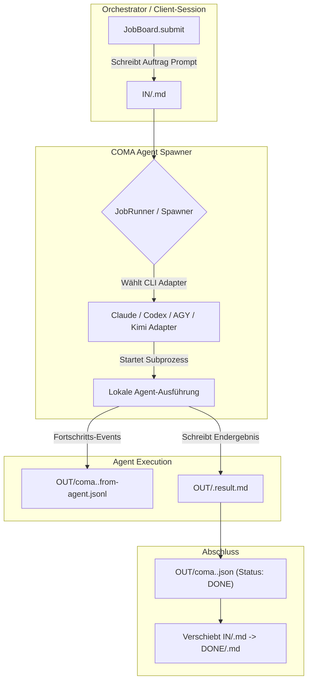

# COMA — Command & Communication for Autonomous Agents

**[English](README.md) | [Deutsch](README_de.md)**

[](https://docs.pytest.org/)
[](pyproject.toml)
[](https://www.python.org/)
[-brightgreen.svg)](pyproject.toml)
[](SECURITY.md)
[](KONZEPT.md)
[](KONZEPT.md)
[](SECURITY.md)
[](LICENSE)
[](llms.txt)
[](https://github.com/ellmos-ai)
[](https://github.com/open-bricks)

> [!NOTE]
> **LLM/KI-Kontext-Index:** Eine maschinenlesbare Spezifikation und Architektur-Übersicht für KI-Agenten befindet sich in [`llms.txt`](llms.txt).

> **Namensmigration:** Das Projekt und das kanonische Python-Paket heißen `COMA` bzw. `coma`. Der frühere Name `COMAS`/`comas` bleibt für eine Übergangsphase als Import- und CLI-Alias verfügbar; neue Integrationen müssen `coma` verwenden.

---

### Schnellnavigation

[Was ist COMA?](#was-ist-coma) · [Anwendungsfälle](#anwendungsfälle) · [Schnellstart](#schnellstart) · [Das Protokoll](#das-protokoll) · [Architektur-Fluss](#architektur-fluss) · [Lebenszyklus-Sequenz](#lebenszyklus-sequenz) · [Die Spawn-Schicht](#die-spawn-schicht) · [Sitzungsplanung](#interaktive-und-headless-sitzungen) · [Starter aus Rollen](#starter-aus-roles) · [Governance & Invarianten](#governance--und-laufzeit-invarianten) · [Kommandozeile](#kommandozeile) · [Tests](#tests) · [Ökosystem](#geschwisterwerkzeuge--ökosystem) · [Sicherheit](#sicherheit) · [Stand & Lizenz](#stand--lizenz)

---

## Was ist COMA?

> Die **Lebenszyklus-Schicht** für Agenten: Wie entsteht ein Agent als eigener Prozess, und wie bleibt man mit ihm in Kontakt, solange er läuft?

COMA steht primär als **session-übergreifender und session-unabhängiger Kommunikations- und Auftragskanal für Agents** (Dateisystem-basiert via `IN/`, `OUT/`, `DONE/`). Als Begriffsauslegung bietet sich **Command / Communication for Agents** an (mit Alternativ-Deutungen wie *agent spawner* oder *agent cloner*, ohne den Paket- und Repository-Namen `coma` zu ändern).

Genau eine Verantwortung: COMA sperrt nichts, verwaltet keine Rechte und hält kein Gedächtnis. Es arbeitet mit Dateien und Prozessen — **ohne Konto, ohne Netz, ohne Cluster**. Null Abhängigkeiten, nur Standardbibliothek.

Konzept, Begründung und Abgrenzung: [`KONZEPT.md`](KONZEPT.md).

| Schicht | Frage | Zuständig |
|---|---|---|
| **Lebenszyklus** | Wie entsteht ein Agent, wie rede ich mit ihm? | **COMA** |
| Anspruch & Locks | Wer darf was anfassen? | `lock-master` → Roshambo |
| Gedächtnis & Verlauf | Wurde das schon versucht, wie ging es aus? | `memoryhooker` / Roshambo |

Die Verben trennen sauber: COMA spricht `spawn`, `send`, `poll`, `result`. Ein Koordinator spricht `claim`, `release`, `remember`, `recall`, `decide`, `status`. Keine Überschneidung.

---

## Anwendungsfälle

1. **Historischer erster Use Case: Entkopplung von Remote-Control-Sessions**
   In einer **Remote-Control-Session** reicht Claude Code `--dangerously-skip-permissions` nicht an den Remote-Client durch (offene Issues [#71518](https://github.com/anthropics/claude-code/issues/71518), [#29214](https://github.com/anthropics/claude-code/issues/29214)). Folge: Jeder Tool-Aufruf fragt nach — auch bei Agenten. Ist niemand am Rechner, **stehen sie still**: unbeaufsichtigte Agenten warten auf Klicks, die niemand gibt.

   Die Lösung ist, den Agenten **gar nicht erst in der RC-Session leben zu lassen**: ein eigener lokaler Prozess außerhalb dieser Session, Kommunikation über das Dateisystem. **COMA umgeht keine Sicherheitsgrenze**, sondern nutzt dokumentierte CLI-Flags (`--permission-mode`, `--allowedTools` und Verwandte) an der Stelle, an der sie tatsächlich ankommen.

2. **Session-übergreifende Handoffs & Multi-Agent Relays**
   Aufgaben werden über Session-Grenzen hinweg zwischen Agents übergeben, ohne dass Prozesse blockieren oder Kontext verloren geht.

3. **Hintergrund-Auftragsverarbeitung**
   Dateisystem-basierte Steuerung (`IN/`, `OUT/`, `DONE/`) für autonome Hintergrund-Läufer und entkoppelte Tool-Ausführungen.

---

## Schnellstart

```python
from coma import JobBoard, JobRunner

board = JobBoard(r"C:\jobs\_agentjobs")
board.submit("meinjob", "# Auftrag\n\nSchreibe das Ergebnis nach OUT/meinjob.result.md.\n")

result = JobRunner(board).run("meinjob")
print(result["status"]["state"], result["result_written"])
```

Oder von der Kommandozeile:

```bat
coma --root C:\jobs\_agentjobs run meinjob
coma --root C:\jobs\_agentjobs run meinjob --dry-run   :: nur zeigen, nichts starten
coma --root C:\jobs\_agentjobs status meinjob
coma --root C:\jobs\_agentjobs result meinjob
```

**`--dry-run` zuerst.** Es baut das vollständige Kommando und zeigt es, ohne dass ein Token fließt.

---

## Das Protokoll

```
IN/    <jobid>.md                       Auftrag (Freitext-Markdown)
OUT/   <jobid>.result.md                Ergebnis
       coma.<jobid>.json               Status      — nur der Runner schreibt
       coma.<jobid>.from-agent.jsonl   Fortschritt — nur der Agent schreibt
       coma.<jobid>.to-agent.jsonl     Nachrichten — nur der Orchestrator schreibt
       coma.<jobid>.console.log        stdout/stderr des Laufs
DONE/  <jobid>.md                       erledigter Auftrag
```

**Ein Schreiber je Datei — kein Locking nötig, Kollision strukturell unmöglich.** Gelesen werden darf von allen. Das ist keine Vorsichtsmaßnahme, sondern eine Lektion: Eine geteilte Logdatei in OneDrive hat schon einmal zu Konfliktkopien geführt.

`.jsonl` für die Kanäle, weil Anhängen atomar ist — ein Schreiber muss nicht erst lesen, parsen und neu schreiben.

Die Auftragsdatei ist **freies Markdown** und enthält den vollständigen Prompt. Der Agent bekommt nur einen **Zeiger** darauf; er liest die Datei selbst und schreibt sein Ergebnis selbst als Datei. Damit hängt die Rückgabe weder an der stdout-Größe noch am Encoding.

### Fernsteuern, lokal ausführen

Eine RC-Session kann Aufträge schreiben und Ergebnisse abholen, ohne den Agenten selbst zu hosten:

```python
from coma import JobBoard, read_result, wait_for_finish

board = JobBoard(root)
paths = board.submit("meinjob", auftrag_markdown)   # 1. Auftrag schreiben
# 2. Lokal läuft irgendwann: coma run meinjob
status = wait_for_finish(paths, timeout=3600)        # 3. Statusdatei beobachten
if status["exit_code"] == 0:
    print(read_result(paths))
```

`wait_for_finish` beobachtet die **Statusdatei**, nicht den Prozess. Genau deshalb funktioniert es aus einem fremden Prozess, einer anderen Session oder über OneDrive von einem anderen Rechner.

### Nachrichten während des Laufs

```python
from coma import from_agent, to_agent

to_agent(paths).append({"kind": "hint", "text": "Nimm Variante B."})   # Orchestrator
for record in from_agent(paths).read():                                # Agent-Meldungen
    print(record)
```

Der Rollen-Parameter ist Dokumentation mit Zähnen: `to_agent(paths).append(…, role="agent")` wirft, statt eine Konfliktkopie zu erzeugen.

---

## Architektur-Fluss



---

## Lebenszyklus-Sequenz

Das nachfolgende Sequenzdiagramm verdeutlicht das lückenlose Zusammenspiel zwischen Orchestrator, COMA-Runner, Subprozess-Adapter und Dateikanälen:


---

## Die Spawn-Schicht

Ein Adapter weiß genau zwei Dinge: wie das Kommando für seine CLI aussieht und welche Umgebung sie braucht. Er startet **nichts** — das macht der `Spawner`. Deshalb ist der Kommandobau ohne Prozessstart prüfbar.

```python
from coma import ClaudeAdapter, Spawner

adapter = ClaudeAdapter(model="sonnet", permission_mode="dontAsk",
                        allowed_tools=["Read", "Write"], max_budget_usd=2.0)
print(adapter.build_cmd("Sag Hallo"))   # nur die Argumentliste, nichts läuft

spawner = Spawner(adapter)
result = spawner.run("Sag Hallo", log_file="lauf.log")
handle = spawner.start("Sag Hallo", log_file="lauf.log")   # nicht blockierend
while handle.poll() is None:
    ...
```

### Adapter

| Adapter | Ziel | Stand |
|---|---|---|
| `claude` | Claude Code CLI | **Verifiziert** — Flags gegen `claude --help` 2.1.263 geprüft, echter Durchlauf belegt |
| `codex` | native `codex exec` | **Verifiziert** — CLI 0.153.4, read-only/workspace-write, Ergebnisdatei via `--output-last-message` |
| `agy` | Antigravity/Gemini | **Verifiziert** — agy 1.1.27, stdout und Exitcode live geprüft; Job-Ergebnisdatei bleibt kanonisch |
| `kimi` | Kimi Code CLI | **Gerüst** — Hilfevertrag mit CLI 0.31.0 geprüft; kein echter Promptlauf belegt |

`verified` ist keine Kosmetik: Der `Spawner` **weigert sich**, einen Gerüst-Adapter zu starten, solange nicht ausdrücklich `allow_unverified=True` gesetzt ist. So ist Adapterwissen dokumentiert und getestet, ohne dass ein ungetesteter Aufrufweg unbemerkt in einen unbeaufsichtigten Lauf gerät.

---

## Interaktive und Headless-Sitzungen

`build_session_plan()` liefert einen gemeinsamen, prozessfreien Vertrag für
interaktive und Headless-argv von Claude, Codex, Agy und Kimi. Rollenpromptdatei
und Nutzerauftrag bleiben getrennte Argumente. `ordered_candidates()` und
`available_candidates()` bauen die geordnete Anbieter-Fallback-Kette;
`build_probe_command()` und `probe()` stellen eine begrenzte Read-only-Sonde mit
Cleanup des eigenen Kindprozesses bereit. Kimi bleibt ohne ausdrückliches Opt-in
fail-closed, solange kein echter COMA-Promptlauf belegt ist.

```python
from coma import build_session_plan

plan = build_session_plan(
    "codex", prompt_file="AGENTS.md", request="Prüfe die aktuelle Änderung.",
    mode="interactive", model="gpt-6", effort="high", cwd=".",
)
print(plan.command)  # nur argv; kein Prozess wurde gestartet
```

```bat
coma adapters      :: zeigt Stand, gefundene Binary und die Fallstricke je Adapter
```

### Der Permission-Mode bleibt Parameter

`dontAsk` und `bypassPermissions` sind **verschiedene Sicherheitsprofile**, nicht zwei Namen für dasselbe:

- **`dontAsk`** fragt nie, sondern **verweigert**. Zusammen mit einer expliziten Werkzeugliste kann ein Agent damit strukturell nicht hängenbleiben. Für unbeaufsichtigte Läufe die bessere Wahl — und deshalb der Standard.
- **`bypassPermissions`** kann in Sonderfällen weiterhin nachfragen. In einer RC-Session heißt das: Der Agent steht, bis jemand klickt.

Drei benannte Profile, jedes mit belegter Herkunft:

```python
ClaudeAdapter.preset("unattended")   # Standard: dontAsk + explizite Werkzeugliste
ClaudeAdapter.preset("read_only")    # dontAsk + Read,Glob,Grep
ClaudeAdapter.preset("bat_compat")   # die verifizierte Startschale: bypassPermissions
```

### Werkzeuglisten: zwei Flags, zwei Bedeutungen

`--tools` begrenzt, welche Built-ins überhaupt **existieren**; `--allowedTools` gibt sie **vorab frei**. Verschiedene Dinge, deshalb zwei Parameter:

```python
ClaudeAdapter(allowed_tools=["Read"], available_tools=["Read", "Bash"])
# --tools Read,Bash --allowedTools Read
#   -> Bash ist da, aber nicht freigegeben: unter dontAsk wird es verweigert.
```

| Wert | Wirkung |
|---|---|
| `["Read", "Write"]` | Liste, komma-verbunden als **ein** Argument |
| `MIRROR` (Standard für `available_tools`) | spiegelt `allowed_tools` |
| `NO_RESTRICTION` / `None` | Flag entfällt ganz |
| `[]` bei `available_tools` | `--tools ""` — alle Built-ins abschalten |

MCP lässt sich über `--tools` nicht abschalten; dafür gibt es `--disallowedTools mcp__*`, standardmäßig gesetzt (`allow_mcp=True` hebt es auf).

---

## Starter aus `roles[]`

`coma starters generate` liest die `roles[]`-Deklarationen eines Modul-Manifests
und schreibt ein schlankes `START.bat` sowie ein ausführbares `start.sh`. Beide
leiten an die gemeinsame Konsole weiter, falls installiert, und bieten ansonsten
den transparenten COMA-Fallback. Der Generator überschreibt Dateien nur bei
vorhandenem Marker oder explizitem `--force`.

```bat
coma starters generate --manifest ellmos-module.v2.json --output-dir starters
starters\START.bat tasksolver --provider codex --dry-run
```

---

## Lock-Schnittstelle: definiert, nicht implementiert

COMA sperrt nichts. Es ruft Claims über eine schmale Schnittstelle auf, nicht gegen ein konkretes Modul:

- `comalock` = COMA + `lock-master` (lokal, offline)
- `comaroshambo` = COMA + Roshambo (verteilt, Cloud)

```python
from coma import LockBackend, claimed   # LockBackend ist ein Protocol

with claimed(mein_backend, "pfad/zum/projekt", kind="project"):
    JobRunner(board).run("meinjob")
```

Der Standard ist `NullLock` — gewährt alles, merkt sich nichts.

---

## Governance- und Laufzeit-Invarianten

Zur Wahrung der Systemintegrität und Deterministik gelten 8 strikte Invarianten:

| ID | Invariante | Beschreibung |
|---|---|---|
| **INV-COMA-01** | **Single-Writer-Regel** | Jede Datei in `_agentjobs/` hat exakt einen Schreiber (`IN/` durch Ersteller, `to-agent.jsonl` durch Orchestrator, `from-agent.jsonl`/`result.md` durch Agent, `coma.<jobid>.json` durch Runner). Verhindert Sperrkonflikte und Cloud-Synckonflikte. |
| **INV-COMA-02** | **Zero Network Egress** | Die Kernbibliothek macht 0 Netzwerkaufrufe, öffnet keine Ports und besitzt null externe Paket-Abhängigkeiten. Reines Standardbibliotheks-Design. |
| **INV-COMA-03** | **Sitzungsentkopplung** | Subprozesse laufen in unabhängigen OS-Prozessbäumen außerhalb interaktiver Terminals, wodurch Remote-Control-Blockaden umgangen werden. |
| **INV-COMA-04** | **Prozessfreie Trockenläufe** | Kommandobauer (`build_cmd`, `build_session_plan`, `--dry-run`) konstruieren Argumentlisten deterministisch ohne Prozessstart und ohne Tokenverbrauch. |
| **INV-COMA-05** | **Deterministischer CLI-Fallback** | Anbieter-Fallback-Ketten (`ordered_candidates`) lösen Binaries strikt geordnet auf, ohne ungetestete Engines still auszuführen. |
| **INV-COMA-06** | **Fail-Closed Anbieterschutz** | Gerüst-Adapter (wie Kimi) verweigern reale Promptläufe fail-closed, solange kein belegter Ausführungsvertrag vorliegt. |
| **INV-COMA-07** | **Begrenztes Sonden-Cleanup** | Erreichbarkeitssonden (`probe()`) erzwingen harte Timeouts und räumen Kindprozesse garantiert auf, um Zombie-Prozesse zu verhindern. |
| **INV-COMA-08** | **Idempotente Dual-Plattform-Starter** | Starter-Skripte (`START.bat`, `start.sh`) aus `roles[]` besitzen Schutzmarker gegen unbeabsichtigtes Überschreiben eigener Modifikationen. |

---

## Kommandozeile

| Befehl | Zweck |
|---|---|
| `run [jobid]` | Job starten (Ersatz für `START-LOCAL-AGENT.bat`); ohne ID der älteste |
| `run … --dry-run` | Kommando bauen und zeigen, nichts starten |
| `cmd <prompt>` | Kommando für einen freien Prompt zeigen |
| `session --provider … --prompt-file … --request …` | Interaktive/Headless-Rollensitzung planen oder starten |
| `starters generate` · `starters run` | Dual-Plattform-Starter aus `roles[]` generieren oder COMA-Fallback nutzen |
| `submit <jobid>` | Auftrag in `IN/` ablegen (`--file` oder stdin) |
| `status <jobid>` · `list` | Zustand eines Jobs bzw. aller Jobs |
| `result <jobid>` · `log <jobid>` | Ergebnisdatei bzw. Konsolenlog ausgeben |
| `send <jobid> <text>` · `inbox <jobid>` | Nachricht an den Agenten bzw. dessen Meldungen |
| `adapters` | Adapter, Stand, gefundene Binary, Fallstricke |
| `check` · `vendor` | Manifest prüfen bzw. schreiben |

`--json` gibt es überall, `--root` bestimmt das Jobverzeichnis.

---

## Tests

```bat
python -m pytest -q      :: 262 Tests bestanden (100% grün)
```

**Kein Test startet einen Anbieter.** Eine begrenzte Sondenprobe nutzt den
lokalen Python-Interpreter als harmlose Fake-CLI; alle übrigen Subprozessaufrufe
sind ersetzt. So fließen keine Tokens und die argv-Verträge bleiben deterministisch.

---

## Geschwisterwerkzeuge & Ökosystem

COMA ist integraler Bestandteil der `ellmos-ai` Orchestrierungsarchitektur und des übergeordneten Open-Source-Dachverbunds `open-bricks`:

| Schicht / Ökosystem | Repository | Zweck |
|---|---|---|
| **Agent-Orchestrierung** | [`ellmos-ai/coma`](https://github.com/ellmos-ai/coma) | Lebenszyklus-Spawner & entkoppeltes dateibasiertes Job-Board |
| **Autonomer Stream** | [`ellmos-ai/rinnsal`](https://github.com/ellmos-ai/rinnsal) | SQLite-gepufferte autonome Stream-Engine & Connector-Relay |
| **Bedingungsprüfung** | [`ellmos-ai/condition-gates`](https://github.com/ellmos-ai/condition-gates) | Vorbedingungsprüfung, Evidenzprüfung & Laufzeit-Invarianten |
| **Lock-Governance** | [`ellmos-ai/lock-master`](https://github.com/ellmos-ai/lock-master) | Zentrale Projektsperren & Multi-Tree-Koordination (Roshambo) |
| **Hook-Verwaltung** | [`ellmos-ai/hook-master`](https://github.com/ellmos-ai/hook-master) | Kanonische Hook-Verwaltung & Multi-Agenten-Materialisierung |
| **Governance & Policies** | [`ellmos-ai/policy-registry`](https://github.com/ellmos-ai/policy-registry) | Zentrale Richtlinien-, Rollen- und Delegationsverwaltung |
| **Flotten-Operationen** | [`ellmos-ai/agent-ops-stack`](https://github.com/ellmos-ai/agent-ops-stack) | Multi-Agenten-Betrieb, Health-Telemetrie & Überwachung |
| **Datentransit** | [`ellmos-ai/sqlite-transit-sync`](https://github.com/ellmos-ai/sqlite-transit-sync) | Zero-Copy Transaktions- und SQLite-Replikationssynchronisation |
| **Automationsfluss** | [`ellmos-ai/workflowhooker`](https://github.com/ellmos-ai/workflowhooker) | Ereignis-Trigger, Pipeline-Hooks & Webhook-Orchestrierung |
| **Gedächtniserhalt** | [`ellmos-ai/memoryhooker`](https://github.com/ellmos-ai/memoryhooker) | Kontexterhalt, episodisches Gedächtnis & Lesson-Synthese |
| **Agenten-Bootstrap** | [`dev-bricks/safe-start-for-codex`](https://github.com/dev-bricks/safe-start-for-codex) | Sichere Initialisierung, Umgebungschecks & Preflight-Diagnostik |
| **Dachorganisation** | [`open-bricks`](https://github.com/open-bricks) | Open-Source-Dach für lokale Entwickler-Werkzeuge |

---

## Sicherheit

Details zur Prozessisolierung, den Protokollgrenzen nach dem Single-Writer-Prinzip und Richtlinien zur Offenlegung von Schwachstellen finden sich in [`SECURITY.md`](SECURITY.md).

---

## Stand & Lizenz

Version 0.3.0. Lizenz: MIT. Das Quellrepository gehört zum `ellmos-ai` / `open-bricks` Ökosystem.
