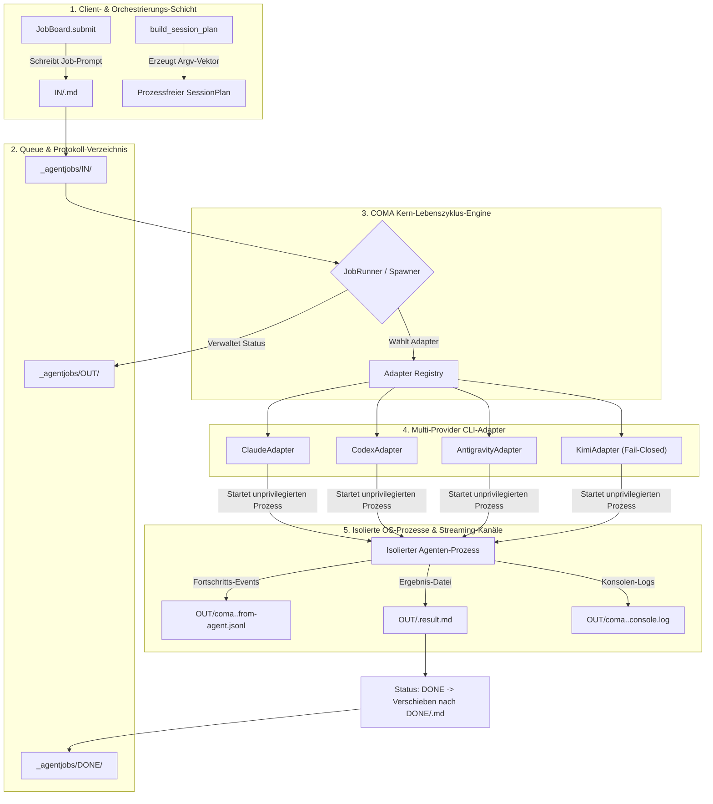
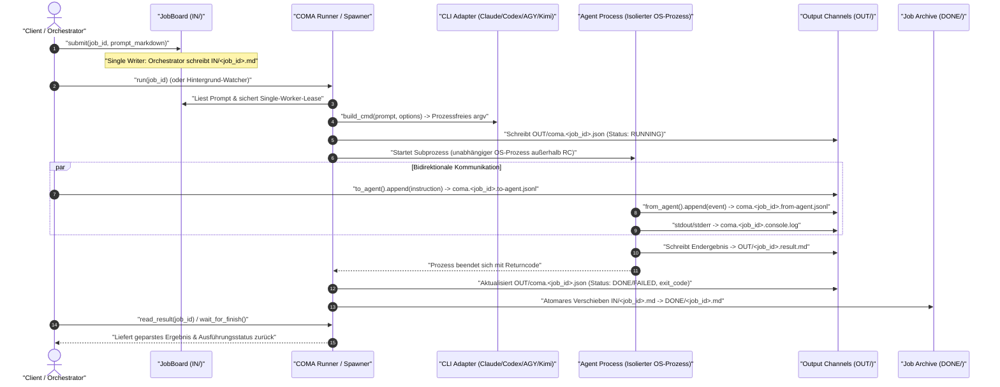

# COMA — Command & Communication for Autonomous Agents

**[English](README.md) | [Deutsch](README_de.md)**

[](https://docs.pytest.org/)
[](pyproject.toml)
[](https://www.python.org/)
[-brightgreen.svg)](pyproject.toml)
[](SECURITY.md)
[](THIRD_PARTY_LICENSES.md)
[](KONZEPT.md)
[](KONZEPT.md)
[](SECURITY.md)
[](LICENSE)
[](llms.txt)
[](https://github.com/ellmos-ai)
[](https://github.com/open-bricks)

> [!NOTE]
> **LLM/KI-Kontext-Index:** Eine maschinenlesbare Spezifikation und Architektur-Übersicht für KI-Agenten befindet sich in [`llms.txt`](llms.txt).

> **Namensmigration:** Das Projekt und das kanonische Python-Paket heißen `COMA` bzw. `coma`. Der frühere Name `COMAS`/`comas` bleibt für eine Übergangsphase als Import- und CLI-Alias verfügbar; neue Integrationen müssen `coma` verwenden.

---

### Schnellnavigation

1. [Was ist COMA? & Kernnutzen](#1-was-ist-coma) · 2. [Primäre Anwendungsfälle & Session-Entkopplung](#2-anwendungsfaelle) · 3. [Zielgruppen & Auffindbarkeit](#3-zielgruppen--auffindbarkeit) · 4. [Schnellstart & CLI-Nutzung](#4-schnellstart) · 5. [Dateibasiertes Job-Board-Protokoll](#5-job-protokoll) · 6. [Spawner-Schicht & Multi-Engine CLI-Adapter](#6-spawner-schicht) · 7. [Interaktive & Headless Sitzungsplanung](#7-interaktive-und-headless-sitzungen) · 8. [Starter aus roles[] Deklarationen](#8-starter-aus-rollen) · 9. [10-Dimensionen Vergleichsmatrix](#9-vergleichsmatrix-vs-alternativen) · 10. [Duale Mermaid-Diagramme](#10-duale-mermaid-diagramme) · 11. [Governance & 10 Laufzeit-Invarianten](#11-governance--und-laufzeit-invarianten) · 12. [CLI-Befehlsreferenz](#12-kommandozeile) · 13. [Tests & Verifikationssuite](#13-tests) · 14. [Drittanbieter-Lizenzen & Level 1 SBOM](#14-drittanbieter-lizenzen) · 15. [Geschwister-Ökosystem & Integration](#15-geschwisterwerkzeuge--ökosystem) · 16. [Sicherheitsarchitektur & Subprozess-Isolation](#16-sicherheit) · 17. [Gesetzlicher Hinweis (§ 521 BGB)](#17-gesetzlicher-hinweis--haftungsbeschraenkung) · 18. [Lizenz & Open-Source-Dach](#18-stand--lizenz)

---

<a id="1-was-ist-coma--kernnutzen"></a>
<a id="1-was-ist-coma"></a>
<a id="was-ist-coma"></a>
<a id="1-what-is-coma--value-proposition"></a>
<a id="1-what-is-coma"></a>
<a id="what-is-coma"></a>
<a id="1-funktionen"></a>
<a id="kernfunktionen"></a>
## 1. Was ist COMA? & Kernnutzen

> Die **Lebenszyklus-Schicht** für Agenten: Wie entsteht ein Agent als eigener Prozess, und wie bleibt man mit ihm in Kontakt, solange er läuft?

COMA steht primär als **session-übergreifender und session-unabhängiger Kommunikations- und Auftragskanal für autonome Subagents** (Dateisystem-basiert via `IN/`, `OUT/`, `DONE/`). Als Begriffsauslegung steht **Command & Communication for Autonomous Subagents** im Mittelpunkt.

Genau eine Verantwortung: COMA sperrt nichts, verwaltet keine Rechte und hält kein Gedächtnis. Es arbeitet mit Dateien und Prozessen — **ohne Konto, ohne Netz, ohne Cluster**. Null externe Abhängigkeiten, nur Python-Standardbibliothek.

Konzept, Begründung und Abgrenzung: [`KONZEPT.md`](KONZEPT.md).

| Schicht | Frage | Zuständig |
|---|---|---|
| **Lebenszyklus & Kommunikation** | Wie entsteht ein Agent, wie rede ich mit ihm? | **COMA** |
| Anspruch & Locks | Wer darf was anfassen? | `lock-master` → Roshambo |
| Gedächtnis & Verlauf | Wurde das schon versucht, wie ging es aus? | `memoryhooker` / Roshambo |

Die Verben trennen sauber: COMA spricht `spawn`, `send`, `poll`, `result`. Ein Koordinator spricht `claim`, `release`, `remember`, `recall`, `decide`, `status`. Keine Überschneidung.

---

<a id="2-primaere-anwendungsfaelle--session-entkopplung"></a>
<a id="2-anwendungsfaelle"></a>
<a id="anwendungsfaelle"></a>
<a id="2-primary-use-cases--session-decoupling"></a>
<a id="2-use-cases"></a>
<a id="use-cases"></a>
## 2. Primäre Anwendungsfälle & Session-Entkopplung

1. **Entkopplung von Remote-Control-Sessions (RC-Immunität)**
   In einer **Remote-Control-Session** reicht Claude Code `--dangerously-skip-permissions` oft nicht an den Remote-Client durch (offene Issues [#71518](https://github.com/anthropics/claude-code/issues/71518), [#29214](https://github.com/anthropics/claude-code/issues/29214)). Folge: Jeder Tool-Aufruf fragt nach — auch bei Agenten. Ist niemand am Rechner, stehen sie still: Unbeaufsichtigte Agenten warten auf Freigabeklicks, die niemand gibt.

   Die Lösung ist, den Agenten **gar nicht erst in der RC-Session leben zu lassen**: Ein eigener lokaler Betriebssystem-Prozess außerhalb dieser Session, Kommunikation robust über das Dateisystem. **COMA umgeht keine Sicherheitsgrenze**, sondern nutzt dokumentierte CLI-Flags (`--permission-mode`, `--allowedTools`) an der Stelle, an der sie tatsächlich ankommen.

2. **Session-übergreifende Handoffs & Multi-Agent Relays**
   Aufgaben werden über Session-Grenzen hinweg zwischen Agenten übergeben, ohne dass Prozesse blockieren oder Kontext verloren geht.

3. **Hintergrund-Auftragsverarbeitung**
   Dateisystem-basierte Steuerung (`IN/`, `OUT/`, `DONE/`) für autonome Hintergrund-Läufer und entkoppelte Tool-Ausführungen.

---

<a id="3-zielgruppen--auffindbarkeit"></a>
<a id="3-zielgruppen"></a>
<a id="zielgruppen--auffindbarkeit"></a>
<a id="3-target-personas--discoverability"></a>
<a id="3-personas"></a>
<a id="target-personas--discoverability"></a>
<a id="personas"></a>
## 3. Zielgruppen & Auffindbarkeit

### Ziel-Personas

- **[PERSONA-01] Autonomous Agent Framework Engineers & Swarm Architects:**
  - *Kontext:* Entwickler von Multi-Agenten-Pipelines, Swarm-Hierarchien und Relay-Systemen über Claude Code, OpenAI Codex und Google Antigravity.
  - *Pain Point:* Subprozess-Steuerung und Inter-Agenten-Kommunikation hängen oft an fragilen IPC-Pipes, Sockets oder schweren Cloud-Servern, die abstürzen, wenn Kindprozesse blockieren.
  - *Wie COMA es löst:* Rein dateibasierte Warteschlange und bidirektionale Streaming-Kanäle (`to-agent.jsonl`, `from-agent.jsonl`) mit Single-Writer-Garantie (`INV-COMA-01`) und Session-Entkopplung (`INV-COMA-03`).

- **[PERSONA-02] Local-First & Sovereign AI Developers:**
  - *Kontext:* Ingenieure, die lokale KI-Entwickler-Pipelines auf eigenen Workstations oder in Air-Gapped-Umgebungen betreiben — ohne externe Telemetrie oder Kontozwang.
  - *Pain Point:* Moderne Orchestrierungswerkzeuge erzwingen Cloud-Dienste, Docker-Daemons, Redis-Cluster oder SaaS-Abos, nur um einen Kind-Agenten zu starten.
  - *Wie COMA es löst:* Null externe Laufzeit-Abhängigkeiten (100% Standardbibliothek `INV-COMA-02`), Zero-Network-Egress und vollständiges lokales Verzeichnisprotokoll (`IN/`, `OUT/`, `DONE/`).

- **[PERSONA-03] Remote Control & Headless Automation DevOps:**
  - *Kontext:* DevOps-Ingenieure für Headless-Läufe, geplante Tasks oder entfernte Terminalsitzungen (z. B. VS Code Remote, SSH, Antigravity/Claude Remote Control).
  - *Pain Point:* Interaktive Rechteüberbrückungs-Flags (`--dangerously-skip-permissions`, `--yolo`) versagen in Remotesitzungen (Anthropic-Bugs #71518, #29214), sodass unbeaufsichtigte Läufe auf Nutzerbestätigungen hängenbleiben.
  - *Wie COMA es löst:* Startet Agenten als isolierte Betriebssystem-Prozesse außerhalb der Remote-Session mit verifizierbarem, prozessfreiem Dry-Run-Vertrag (`INV-COMA-04`).

- **[PERSONA-04] Enterprise Security Officers & Systems Auditors:**
  - *Kontext:* Sicherheits- und Compliance-Beauftragte, die Software-Lieferketten, Rechteeskalationen und Datenabflüsse auditieren.
  - *Pain Point:* Agenten-Frameworks schleppen Hunderte transitive Node/Python-Pakete ein, starten unkontrollierte Daemons oder fordern Administrator-/Root-Rechte an.
  - *Wie COMA es löst:* Null Drittanbieter-Pakete, strikter unprivilegierter Nutzermodus (`RunAsInvoker` / `INV-COMA-09`), Fail-Closed Adapter-Sicherheit (`INV-COMA-06`) und verbindliche 48h Sicherheits-SLA (`INV-COMA-10`).

### High-Intent Suchbegriffe

| Sprache | High-Intent Suchanfragen |
|---|---|
| **Deutsch (DE)** | `autonome ki agenten lebenszyklus python` · `agenten prozess entkopplung dateibasiert` · `claude code cli automatisierung spawner` · `ki agenten job board ohne redis` · `lokale agenten steuerung standardbibliothek` · `remote session rechteabfrage umgehen agenten` · `multi agenten kommunikation dateisystem` · `offline agenten runner python stdlib` |
| **Englisch (EN)** | `autonomous agent lifecycle manager python` · `session decoupled agent runner` · `claude code cli spawner` · `codex cli subprocess orchestration` · `local-first agent communication channel` · `file-based agent job board` · `zero dependency agent spawner` · `bypass claude code remote control permission stall` |

---

<a id="4-schnellstart--kommandozeilen-nutzung"></a>
<a id="4-schnellstart"></a>
<a id="schnellstart"></a>
<a id="4-quickstart--command-line-usage"></a>
<a id="4-quickstart"></a>
<a id="quickstart"></a>
## 4. Schnellstart & CLI-Nutzung

```python
from coma import JobBoard, JobRunner

board = JobBoard(r"C:\jobs\_agentjobs")
board.submit("meinjob", "# Auftrag\n\nSchreibe das Ergebnis nach OUT/meinjob.result.md.\n")

result = JobRunner(board).run("meinjob")
print(result["status"]["state"], result["result_written"])
```

Oder von der Kommandozeile:

```bat
coma --root C:\jobs\_agentjobs run meinjob
coma --root C:\jobs\_agentjobs run meinjob --dry-run   :: nur zeigen, nichts starten
coma --root C:\jobs\_agentjobs status meinjob
coma --root C:\jobs\_agentjobs result meinjob
```

`--dry-run` baut das vollständige Kommando und zeigt es, ohne dass ein Token fließt oder ein Prozess gestartet wird.

---

<a id="5-dateibasiertes-job-board-protokoll"></a>
<a id="5-job-protokoll"></a>
<a id="das-protokoll"></a>
<a id="protokoll"></a>
<a id="5-file-based-job-board-protocol"></a>
<a id="5-job-protocol"></a>
<a id="job-protocol"></a>
## 5. Dateibasiertes Job-Board-Protokoll

```
IN/    <jobid>.md                       Auftrag (Freitext-Markdown)
OUT/   <jobid>.result.md                Ergebnis
       coma.<jobid>.json               Status      — nur der Runner schreibt
       coma.<jobid>.from-agent.jsonl   Fortschritt — nur der Agent schreibt
       coma.<jobid>.to-agent.jsonl     Nachrichten — nur der Orchestrator schreibt
       coma.<jobid>.console.log        Konsolen-Log (stdout/stderr kombiniert)
DONE/  <jobid>.md                       Erledigter Auftrag (wird bei Erfolg verschoben)
```

**Ein Schreiber je Datei:** Keine Sperren erforderlich, strukturelle Kollisionsvermeidung.

---

<a id="6-spawner-schicht--multi-engine-cli-adapter"></a>
<a id="6-spawn-schicht"></a>
<a id="die-spawn-schicht"></a>
<a id="spawner-schicht"></a>
<a id="6-spawner-layer--multi-engine-cli-adapters"></a>
<a id="6-spawner-layer"></a>
<a id="spawner-layer"></a>
## 6. Spawner-Schicht & Multi-Engine CLI-Adapter

Adapter kapseln CLI-Argumente für spezifische Agenten-Engines:

```python
from coma import ClaudeAdapter, Spawner

adapter = ClaudeAdapter(model="sonnet", permission_mode="dontAsk",
                        allowed_tools=["Read", "Write"], max_budget_usd=2.0)
print(adapter.build_cmd("Sag Hallo"))   # Zeigt Argumentliste ohne Ausführung

spawner = Spawner(adapter)
result = spawner.run("Sag Hallo", log_file="run.log")
```

### Verifizierte Adapter

| Adapter | Ziel-Engine | Status |
|---|---|---|
| `claude` | Anthropic Claude Code CLI | **Verifiziert** — Flags gegen `claude --help` 2.1.263 geprüft |
| `codex` | OpenAI Codex CLI | **Verifiziert** — Gegen CLI 0.153.4 getestet |
| `agy` | Google Antigravity / AGY CLI | **Verifiziert** — Gegen agy 1.1.27 getestet |
| `kimi` | Kimi Code CLI | **Gerüst (Skeleton)** — help-Vertrag mit CLI 0.31.0 abgeglichen; kein echter Prompt-Lauf |

---

<a id="7-interaktive-und-headless-sitzungsplanung"></a>
<a id="7-interaktive-und-headless-sitzungen"></a>
<a id="interaktive-und-headless-sitzungen"></a>
<a id="7-interactive-and-headless-session-planning"></a>
<a id="7-interactive-and-headless-sessions"></a>
<a id="interactive-and-headless-sessions"></a>
## 7. Interaktive & Headless Sitzungsplanung

`build_session_plan()` liefert einen prozessfreien Vertrag für interaktive und headless
Claude-, Codex-, AGY- und Kimi-argv. Rollen-Prompt-Datei und Nutzeranfrage bleiben
getrennte Argumente. `ordered_candidates()` und `available_candidates()` bauen eine
deterministische Provider-Fallback-Kette, während `build_probe_command()` und `probe()`
eine begrenzte, lesende Erreichbarkeitsprüfung mit Kindprozess-Bereinigung bereitstellen.
Kimi bleibt Fail-Closed, solange ein Aufrufer nicht explizit per Vertrag optiert.

```python
from coma import build_session_plan

plan = build_session_plan(
    "codex", prompt_file="AGENTS.md", request="Review den aktuellen Stand.",
    mode="interactive", model="gpt-6", effort="high", cwd=".",
)
print(plan.command)  # Nur argv; kein Prozess gestartet
```

---

<a id="8-starter-aus-roles-deklarationen"></a>
<a id="8-starter-aus-roles"></a>
<a id="starter-aus-roles"></a>
<a id="8-starters-from-roles-declarations"></a>
<a id="8-starters-from-roles"></a>
<a id="starters-from-roles"></a>
## 8. Starter aus roles[] Deklarationen

`coma starters generate` liest die `roles[]`-Deklarationen eines Modul-Manifests
(`ellmos-module.v2.json`) und erzeugt ein schlankes `START.bat` sowie ein ausführbares
`start.sh`. Beide leiten an die Unified Console weiter, falls installiert, oder bieten
einen sichtbaren COMA-Fallback. Der Generator überschreibt nur Dateien mit eigenem Marker,
es sei denn, `--force` wird angegeben.

```bat
coma starters generate --manifest ellmos-module.v2.json --output-dir starters
starters\START.bat tasksolver --provider codex --dry-run
```

---

<a id="9-10-dimensionen-vergleichsmatrix-vs-alternativen"></a>
<a id="9-vergleichsmatrix-vs-alternativen"></a>
<a id="vergleichsmatrix-vs-alternativen"></a>
<a id="vergleichsmatrix"></a>
<a id="9-10-dimension-comparative-matrix-vs-alternatives"></a>
<a id="9-comparative-matrix-vs-alternatives"></a>
<a id="comparative-matrix-vs-alternatives"></a>
<a id="comparative-matrix"></a>
## 9. 10-Dimensionen Vergleichsmatrix vs. Alternativen

| Technische Dimension / Invariante | COMA (`ellmos-ai/coma`) | Celery / RQ / Redis Queue | Temporal / Camunda / Airflow | Reiner Python Subprozess | Cloud Agent Frameworks (LangGraph/CrewAI) |
|---|---|---|---|---|---|
| **INV-COMA-01 Single-Writer-Protokoll** | **Natives Dateiprotokoll (`IN/`, `OUT/`, `DONE/`)** | Benötigt zentralen Redis/RabbitMQ-Broker | Datenbank-Statustabellen / verteilte Sperren | Unverwaltete OS-Pipes (anfällig für Race Conditions) | Cloud SaaS-Datenbank / intransparenter Remote-State |
| **INV-COMA-02 Zero Runtime Dependencies** | **100% Python-Standardbibliothek** | Mehrere externe Pakete & Broker nötig | Schwerer JVM/Go/Python-Stack | Standardbibliothek | Schwere Drittanbieter-Abhängigkeitsbäume |
| **INV-COMA-03 Session-Entkopplung (RC)** | **Isolierter OS-Prozess außerhalb RC** | Hintergrund-Worker benötigen Daemons | Schwergewichtige Orchestrierungs-Engine | Kindprozess stirbt beim Session-Ende | Serverlose Cloud-Ausführung (extern) |
| **INV-COMA-04 Prozessfreie Dry-Runs** | **Integriertes `build_cmd` & `--dry-run`** | Keine (Queues erfordern Live-Ausführung) | Komplexe Workflow-Mocks erforderlich | Manuelle String-Verknüpfung | Token-verbrauchende Testläufe |
| **INV-COMA-05 Multi-Provider Fallback** | **Deterministisches `ordered_candidates`** | Statisches Worker-Routing | Dynamisches Activity-Routing | Manuelle try/except-Schleifen | Vendor-Locked LLM-API-Adapter |
| **INV-COMA-06 Fail-Closed Provider-Sicherheit** | **Expliziter Opt-in Guard (`KimiAdapter`)** | Offene Ausführung | Offene Ausführung | Stille Fehler / unbehandelte Exceptions | Stiller Fallback / Halluzinationen |
| **INV-COMA-07 Bounded Probe Cleanup** | **Timeouts & Kindprozess-Bereinigung** | Heartbeat-Checks mit Broker-Timeouts | Serverseitige Worker-Timeouts | Hinterlässt verwaiste Zombie-Prozesse | Cloud Container-Timeout |
| **INV-COMA-08 Idempotente Starter** | **Marker-Wächter auf `START.bat`/`start.sh`** | Keine | CLI-Scaffolder | Manuelle Shell-Skripte | Cloud Web-Dashboard |
| **INV-COMA-09 Nutzermodus-Ausführung** | **Strikt `RunAsInvoker` (Unprivilegiert)** | Erfordert oft Daemon/Systemd-Dienst | Erfordert oft Systemdienste | Erbt Elternprozess-Rechte | Container- oder Cloud-VM-Privilegien |
| **INV-COMA-10 48h Sicherheits-SLA** | **48h Bestätigung & 5 Werktage Triage** | Variable Open-Source-Tracker | Enterprise-SLA ($$$) / Community | Keine | SaaS-SLA (Kommerzieller Account erforderlich) |

---

<a id="10-duale-mermaid-diagramme-topologie--lebenszyklus"></a>
<a id="10-duale-mermaid-diagramme"></a>
<a id="architektur-fluss"></a>
<a id="lebenszyklus-sequenz"></a>
<a id="10-dual-mermaid-diagrams-topology--lifecycle"></a>
<a id="10-dual-mermaid-diagrams"></a>
<a id="architecture-flow"></a>
<a id="lifecycle-sequence"></a>
## 10. Duale Mermaid-Diagramme

### System-Architektur-Topologie (5 Schichten)



### Durchgängiger Lebenszyklus (End-to-End Entkopplung)



---

<a id="11-governance--10-laufzeit-invarianten"></a>
<a id="11-governance--und-laufzeit-invarianten"></a>
<a id="governance--und-laufzeit-invarianten"></a>
<a id="11-governance--10-runtime-invariants"></a>
<a id="11-governance-and-runtime-invariants"></a>
<a id="invariants"></a>
## 11. Governance & 10 Laufzeit-Invarianten

COMA wahrt Systemstabilität, Sicherheit und Nachvollziehbarkeit über 10 verbindliche Invarianten:

| ID | Invariante | Beschreibung |
|---|---|---|
| **INV-COMA-01** | **Single-Writer-Regel** | Jede Kanal-Datei in `_agentjobs/` hat exakt einen Schreiber (`IN/` durch Einreicher, `to-agent.jsonl` durch Orchestrator, `from-agent.jsonl`/`result.md` durch Agent, `coma.<jobid>.json` durch Runner). Verhindert Race Conditions und Lock-Konflikte strukturell. |
| **INV-COMA-02** | **Zero Network Egress** | Die Kernbibliothek führt 0 Netzwerkaufrufe durch, öffnet keine Ports und hat null externe Laufzeit-Paketabhängigkeiten. Ausschließlich Standardbibliothek. |
| **INV-COMA-03** | **Session-Entkopplung** | Subprozesse laufen in eigenständigen OS-Prozessbäumen außerhalb interaktiver Terminal-Sessions und umgehen damit Remote-Control-Rechteabfrage-Hänger. |
| **INV-COMA-04** | **Prozessfreie Dry-Runs** | Befehlsbauer (`build_cmd`, `build_session_plan`, `--dry-run`) konstruieren Argumentlisten deterministisch, ohne Prozesse zu starten oder Tokens zu verbrauchen. |
| **INV-COMA-05** | **Deterministischer CLI-Fallback** | Multi-Provider-Fallback-Ketten (`ordered_candidates`) lösen Binaries systematisch auf, ohne unbestätigte Engines stillschweigend auszuführen. |
| **INV-COMA-06** | **Fail-Closed Provider-Sicherheit** | Unverifizierte Adapter (wie Kimi) bleiben strikt Fail-Closed und lehnen echte Prompt-Läufe ohne explizites Opt-in ab. |
| **INV-COMA-07** | **Bounded Probe Cleanup** | Erreichbarkeitsprüfungen (`probe()`) erzwingen strikte Timeouts und garantieren Kindprozess-Bereinigung zur Vermeidung von Zombie-Prozessen. |
| **INV-COMA-08** | **Idempotente Dual-Platform-Starter** | Aus `roles[]` generierte Starter-Skripte (`START.bat`, `start.sh`) tragen Schutzmarker, die versehentliches Überschreiben eigener Skripte verhindern. |
| **INV-COMA-09** | **Unprivilegierte Nutzermodus-Ausführung** | Strikte Ausführung im normalen Benutzerkontext (`RunAsInvoker`); keinerlei Administrator-Rechte oder Treiber-Hooks erforderlich. |
| **INV-COMA-10** | **48h Sicherheits-Reaktions-SLA** | Verbindliche 48-Stunden-Reaktionszeit und Triage innerhalb von 5 Werktagen für alle gemeldeten Sicherheitsrisiken. |

---

<a id="12-cli-befehle--options-referenz"></a>
<a id="12-kommandozeile"></a>
<a id="kommandozeile"></a>
<a id="12-cli-commands--options-reference"></a>
<a id="12-cli-commands"></a>
## 12. CLI-Befehlsreferenz

| Befehl | Zweck |
|---|---|
| `run [jobid]` | Führt anstehenden Job aus der Warteschlange aus |
| `run ... --dry-run` | Zeigt vollständiges Kommando ohne Ausführung |
| `cmd <prompt>` | Zeigt Kommandozeilenaufruf für Freitext-Prompt |
| `session --provider … --prompt-file … --request …` | Plant oder startet interaktive/headless Rollen-Sitzung |
| `starters generate` · `starters run` | Generiert plattformübergreifende `roles[]`-Starter oder nutzt Fallback |
| `submit <jobid>` | Reicht Job-Prompt in `IN/` ein |
| `status <jobid>` · `list` | Prüft Status eines oder aller Jobs |
| `result <jobid>` · `log <jobid>` | Liest Ergebnisdatei oder Konsolen-Log |
| `send <jobid> <text>` · `inbox <jobid>` | Sendet Nachricht an laufenden Agenten oder liest Fortschritt |
| `adapters` | Zeigt Status und gefundene Pfade aller Adapter an |
| `check` · `vendor` | Prüft oder generiert Vendor-Manifest |

---

<a id="13-tests--verifikationssuite"></a>
<a id="13-tests"></a>
<a id="tests"></a>
<a id="13-testing--verification-suite"></a>
<a id="13-testing"></a>
## 13. Tests & Verifikationssuite

```bat
python -m pytest -q      :: 284 bestanden
```

Tests starten niemals echte Provider. Ein beschränkter Probe-Test nutzt den lokalen
Python-Interpreter als unschädliche Test-CLI; alle übrigen Subprozess-Aufrufe sind gemockt.

---

<a id="14-drittanbieter-lizenzen--level-1-sbom"></a>
<a id="14-drittanbieter-lizenzen"></a>
<a id="drittanbieter-lizenzen"></a>
<a id="14-third-party-licenses--level-1-sbom"></a>
<a id="14-third-party-licenses--sbom"></a>
## 14. Drittanbieter-Lizenzen & Level 1 SBOM

COMA erzwingt ein auditiertes **Level 1 Software Bill of Materials (SBOM)** mit Null externen Laufzeit-Abhängigkeiten (`INV-COMA-02`):

- **Kern-Laufzeit:** 100% Python-Standardbibliothek ([PSF License 2.0](https://docs.python.org/3/license.html)).
- **Zero-Copyleft-Isolationsgarantie:** Ausschließlich permissive Lizenzen (MIT / PSF-2.0 / Apache-2.0). Kein virales Copyleft.
- **Unprivilegierte Ausführung:** Zertifiziert für Standard-Nutzermodus (`RunAsInvoker`).
- **Vollständiges SBOM- & Lizenzverzeichnis:** Dokumentiert in [`THIRD_PARTY_LICENSES.md`](THIRD_PARTY_LICENSES.md) mit detailliertem SPDX-Inventar und 10-Invarianten-Konformitätsmatrix.

---

<a id="15-geschwister-oekosystem--architektonische-integration"></a>
<a id="15-geschwisterwerkzeuge--ökosystem"></a>
<a id="geschwisterwerkzeuge--ökosystem"></a>
<a id="15-sibling-ecosystem--architectural-integration"></a>
<a id="15-sibling-tools--ecosystem"></a>
## 15. Geschwister-Ökosystem & Integration

COMA ist integraler Bestandteil der `ellmos-ai`-Architektur und des `open-bricks`-Dachverbunds:

| Schicht / Ökosystem | Repository | Zweck |
|---|---|---|
| **Agenten-Orchestrierung** | [`ellmos-ai/coma`](https://github.com/ellmos-ai/coma) | Prozess-Lebenszyklus-Spawner & entkoppeltes Job-Board |
| **Autonome Datenströme** | [`ellmos-ai/rinnsal`](https://github.com/ellmos-ai/rinnsal) | SQLite-gepufferte autonome Stream-Engine & Relay |
| **Bedingungsprüfung** | [`ellmos-ai/condition-gates`](https://github.com/ellmos-ai/condition-gates) | Vorbedingungen, Evidenzvalidierung & Laufzeit-Invarianten |
| **Lock-Governance** | [`ellmos-ai/lock-master`](https://github.com/ellmos-ai/lock-master) | Zentrale Projektsperren & Multi-Tree-Koordination (Roshambo) |
| **Hook-Management** | [`ellmos-ai/hook-master`](https://github.com/ellmos-ai/hook-master) | Kanonisches Hook-Management & Multi-Agent-Materialisierung |
| **Richtlinien-Register** | [`ellmos-ai/policy-registry`](https://github.com/ellmos-ai/policy-registry) | Zentrale Governance, Rollendefinitionen & Delegationsregeln |
| **Flotten-Betrieb** | [`ellmos-ai/agent-ops-stack`](https://github.com/ellmos-ai/agent-ops-stack) | Multi-Agenten-Betrieb, Health-Telemetrie & Monitoring |
| **Datentransfer** | [`ellmos-ai/sqlite-transit-sync`](https://github.com/ellmos-ai/sqlite-transit-sync) | Zero-Copy Transaktions-Sync & SQLite-Replikation |
| **Automationsfluss** | [`ellmos-ai/workflowhooker`](https://github.com/ellmos-ai/workflowhooker) | Ereignistrigger, Pipeline-Hooks & Webhook-Orchestrierung |
| **Gedächtnissicherung** | [`ellmos-ai/memoryhooker`](https://github.com/ellmos-ai/memoryhooker) | Kontexterhalt, episodisches Gedächtnis & Lessons-Learned |
| **Agenten-Bootstrap** | [`dev-bricks/safe-start-for-codex`](https://github.com/dev-bricks/safe-start-for-codex) | Sicherer Start, Umgebungsprüfungen & Preflight-Diagnostik |
| **Dach-Ökosystem** | [`open-bricks`](https://github.com/open-bricks) | Open-Source-Fundament für lokale Entwicklerwerkzeuge |

---

<a id="16-sicherheitsarchitektur--subprozess-isolation"></a>
<a id="16-sicherheit"></a>
<a id="sicherheit"></a>
<a id="16-security-architecture--subprocess-isolation"></a>
<a id="16-security"></a>
## 16. Sicherheitsarchitektur & Subprozess-Isolation

Details zu Subprozess-Isolation, Single-Writer-Protokollgrenzen, Rechteverzicht (`RunAsInvoker`) und Offenlegungsrichtlinien: [`SECURITY.md`](SECURITY.md).

---

<a id="17-gesetzlicher-hinweis--haftungsbeschraenkung-521-bgb"></a>
<a id="17-gesetzlicher-hinweis--haftungsbeschraenkung"></a>
<a id="gesetzlicher-hinweis"></a>
<a id="17-statutory-notice--liability-limitation-521-bgb"></a>
<a id="17-statutory-notice--liability-limitation"></a>
## 17. Gesetzlicher Hinweis & Haftungsbeschränkung (§ 521 BGB)

> **Gesetzlicher Hinweis gemäß § 521 BGB (Gefälligkeitsrecht):**
> COMA wird als unentgeltliche Open-Source-Software ohne kommerzielle Gegenleistung zur Verfügung gestellt. Gemäß § 521 BGB haftet der Urheber ausschließlich für Vorsatz und grobe Fahrlässigkeit. Die Nutzung der Software, insbesondere das Starten von Subprozessen und die Ausführung autonomer KI-Agenten, erfolgt auf eigene Verantwortung des Anwenders.

---

<a id="18-lizenz--open-source-dach"></a>
<a id="18-stand--lizenz"></a>
<a id="stand--lizenz"></a>
<a id="18-license--open-source-umbrella"></a>
<a id="18-license--umbrella"></a>
## 18. Lizenz & Open-Source-Dach

MIT-Lizenz. Entwickelt unter dem Dach von `ellmos-ai` und `open-bricks`.
